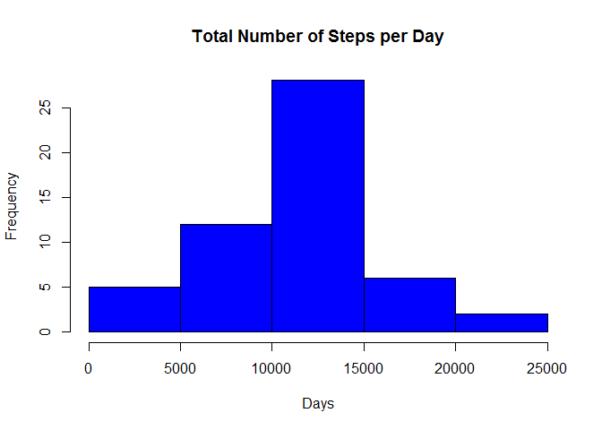
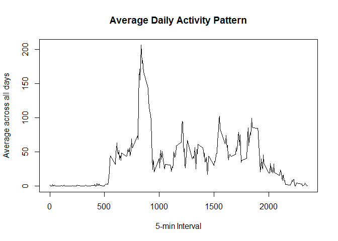
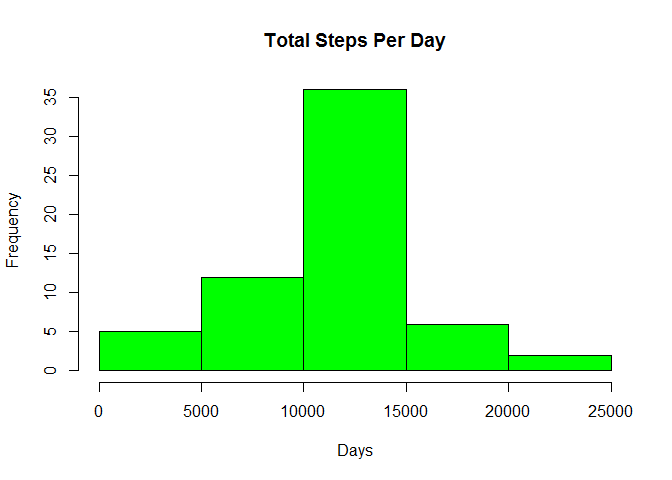
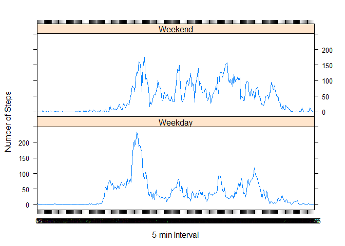

# Reproducible Research: Peer Assessment 1


## Loading and preprocessing the data

The below libraries are required:


```r
library(knitr)
```

```
## Warning: package 'knitr' was built under R version 3.2.2
```

```r
library(ggplot2) #for plotting  
```

```
## Warning: package 'ggplot2' was built under R version 3.2.2
```

```r
library(data.table)
library(lattice)
```

```
## Warning: package 'lattice' was built under R version 3.2.2
```

### 1. Load the data


```r
steps_data <- read.csv("activity.csv", header=TRUE, sep =",",
                      colClasses=c("numeric","character","numeric"))
```
### 2. Checking and tidying up the data


```r
head(steps_data)
```

```
##   steps       date interval
## 1    NA 2012-10-01        0
## 2    NA 2012-10-01        5
## 3    NA 2012-10-01       10
## 4    NA 2012-10-01       15
## 5    NA 2012-10-01       20
## 6    NA 2012-10-01       25
```

```r
names(steps_data)
```

```
## [1] "steps"    "date"     "interval"
```
Now, we convert the date to **Date class** and interval to **Factor class**


```r
steps_data$date <- as.Date(steps_data$date, format = "%Y-%m-%d")  
steps_data$interval <- as.factor(steps_data$interval)
```
Let's check using str():


```r
str(steps_data)
```

```
## 'data.frame':	17568 obs. of  3 variables:
##  $ steps   : num  NA NA NA NA NA NA NA NA NA NA ...
##  $ date    : Date, format: "2012-10-01" "2012-10-01" ...
##  $ interval: Factor w/ 288 levels "0","5","10","15",..: 1 2 3 4 5 6 7 8 9 10 ...
```


## What is mean total number of steps taken per day?

1. Calculating the total number of steps taken per day - ignoring the missing values


```r
steps_per_day <- aggregate(steps ~ date, data = steps_data, sum, na.rm = TRUE)
```
2. The histogram would be as follows:


```r
hist(steps_per_day$steps, main = "Total Number of Steps per Day", xlab = "Days", col = "blue")
```

 

3. Mean and median of the total number of steps taken per day


```r
mean(steps_per_day$steps)
```

```
## [1] 10766.19
```

```r
median(steps_per_day$steps)
```

```
## [1] 10765
```


## What is the average daily activity pattern?

1.Making a time series plot of the 5-minute interval (x-axis) and the avg number of steps taken, averaged across all days (y-axis).

First, getting the average...


```r
time_series <- tapply(steps_data$steps, steps_data$interval, mean, na.rm=TRUE)
```
Second, the plotting...


```r
plot(row.names(time_series), time_series, type = "l", xlab = "5-min Interval", ylab = "Average across all days", main = "Average Daily Activity Pattern", col = "Black")
```

 

2.Finding the average that contains the max number of steps


```r
max_interval <- which.max(time_series)
names(max_interval)
```

```
## [1] "835"
```


## Imputing missing values

1. Calculate and report the total number of missing values in the dataset (i.e. the total number of rows with NAs)


```r
steps_data_NA <- sum(is.na(steps_data))
steps_data_NA
```

```
## [1] 2304
```
2. Devise a strategy for filling in all of the missing values in the dataset. The strategy does not need to be sophisticated. For example, you could use the mean/median for that day, or the mean for that 5-minute interval, etc.

First, NA being replaced with mean in 5-min interval

```r
steps_average <- aggregate(steps ~ interval, data = steps_data, FUN = mean)
fill_NA <- numeric()
for (i in 1:nrow(steps_data)) {
    df <- steps_data[i,]
    if (is.na(df$steps)) {
      steps <- subset(steps_average, interval == df$interval)$steps
    } else {
      steps <- df$steps
    }
    fill_NA <- c(fill_NA, steps)
}
```

3. Create a new dataset that is equal to the original dataset but with the missing data filled in.


```r
new_steps_data <- steps_data
new_steps_data$steps <- fill_NA
```

4. Make a histogram of the total number of steps taken each day and Calculate and report the mean and median total number of steps taken per day. Do these values differ from the estimates from the first part of the assignment? What is the impact of imputing missing data on the estimates of the total daily number of steps?


```r
steps_per_day2 <- aggregate(steps ~ date, data = new_steps_data, sum, na.rm=TRUE)
```
The histogram is:


```r
hist(steps_per_day2$steps, main = "Total Steps Per Day", xlab = "Days", col = "Green")
```

 

The mean and the median are:


```r
mean(steps_per_day2$steps)
```

```
## [1] 10766.19
```

```r
median(steps_per_day2$steps)
```

```
## [1] 10766.19
```
The above value is slightly differs for median:
**Before**
Mean is 10766.19 and median is 10765

**After**
Mean is 10766.19 and median is 10766.19

We can observe that the median has changed and matches to the mean.


## Are there differences in activity patterns between weekdays and weekends?
1. Create a new factor variable in the dataset with two levels – “weekday” and “weekend” indicating whether a given date is a weekday or weekend day.


```r
day <- weekdays(steps_data$date)
daylevel <- vector()
for (i in 1:nrow(steps_data)) {
    if (day[i] == "Saturday") {
       daylevel[i] <- "Weekend"
    } else if (day[i] == "Sunday") {
       daylevel[i] <- "Weekend"
    } else {
       daylevel[i] <- "Weekday"
    }
}
steps_data$daylevel <- daylevel
steps_data$daylevel <- factor(steps_data$daylevel)

stepsbyday <- aggregate(steps ~ interval + daylevel, data = steps_data, mean)
names(stepsbyday) <- c("interval", "daylevel", "steps")
```

2. Make a panel plot containing a time series plot (i.e. type = "l") of the 5-minute interval (x-axis) and the average number of steps taken, averaged across all weekday days or weekend days (y-axis). See the README file in the GitHub repository to see an example of what this plot should look like using simulated data


```r
xyplot(steps ~ interval | daylevel, stepsbyday, type = "l", layout = c(1,2), xlab = "5-min Interval", ylab = "Number of Steps")
```

 

The activity patterns are different between weekend and weekdays as weekends has more peeks of over 100 number of steps compared to weekday. However, weekday has the greatest peak of over 200 number of steps.
